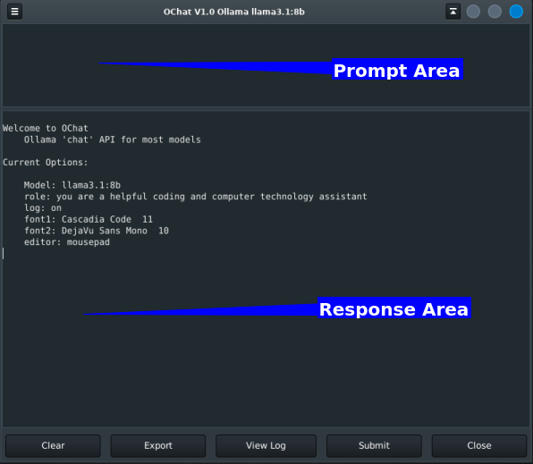

# OChat
### Desktop AI chat for Ollama models

_Mostly for Linux (might work on Windows)_

_GUI desktop AI client for conversing with
    Ollama's downloadable Models_
    
Of course you will need the Ollama runtime  
download from  [Ollams.com](https://ollama.com/ "title")  

Suggest 32G memory and very fast CPU. GPU if you got it.
    

**Clear** Starts new conversation  
**Export** Transfers response markdown to HTML in system default browser  
**View log** View log text in the response pane  
**Submit** Send query to the AI (Ctrl-G)  
**Close** Exit application  

### Keyboard Commands

        Ctrl-H     This help message
        Ctrl-F     Find text
        Ctrl-N     Find next
        Ctrl-Q     Quit App
        Ctrl-G     Execute AI request
        Ctrl-O     Open options in text editor
        Ctrl-D     Delete Log
        Alt-Ctrl-C Copy Code in Markup
---

### Options.ini

        # model=deepseek-coder-v2:16b
        # model=qwen2.5-coder:14b
        model=llama3.1:8b
        role=you are a helpful coding and technology assistant
        log=on
        font1=Cascadia Code
        fontsz1=11
        font2=DejaVu Sans Mono
        fontsz2=10
        height=150
        color=#8888ff
        editor=mousepad

These options are self explanatory.
"color" refers to text color of the response area.
If you've set up the "editor" option, then you can
edit the options.ini file by hitting Ctrl-O.

## Using

On exiting the program, the conversation is not ended (deleted). Upon starting the program
you are prompted to either start a new conversation or continue the previous one.

The conversation is stored in a file called 'conversation.json'

The program only saves each current conversation. Past conversations are not labeled and stored,
but would be reflected in the 'log' until you delete the log (Ctrl-D).

