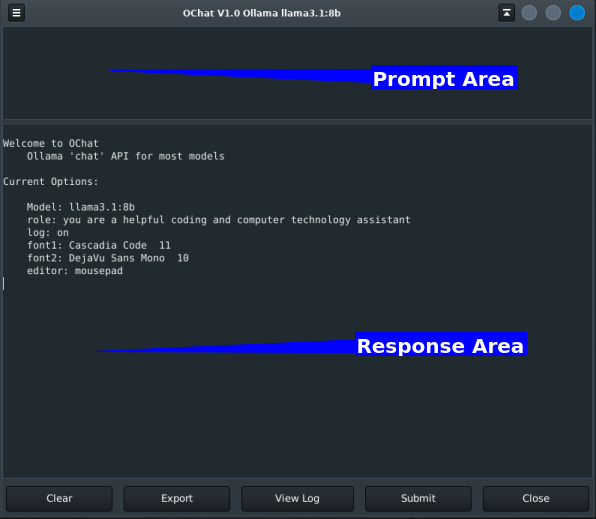

# OChat
### Desktop AI chat for [Ollama](https://github.com/ollama/ollama "title") local models

_Uses wxpython_

_GUI desktop AI client for conversing with
    Ollama's downloadable Models_

Of course you will need the Ollama runtime  
download from  [Ollama.com](https://ollama.com/ "Download to install runtime for Ollama")  

Suggest 32G memory and a core i5 or better CPU, and GPU.  
If running without a GPU stick to models that are 2b - 14b.

 
&nbsp;&nbsp;&nbsp;
                     

| Button | Action | 
| ---: | :--- | 
|**Clear**|Starts new conversation|
|**Export**|Transfers response markdown to HTML in system default browser|
|**View log**|View log text in the response pane|
|**Submit**|Send query to a local AI model (Ctrl-G)(Ctrl-Enter)|
|**Close**|Exit application|

---

### Keyboard Commands

| Keys | Action | 
| :--- | :--- | 
|**Ctrl-H**|This help message|
|**Ctrl-F**|Find text|
|**Ctrl-N**|Find next|
|**Ctrl-Q**|Quit App|
|**Ctrl-G**|Execute AI request|
|**Ctrl-Enter**|Execute AI request|
|**Ctrl-O**|Open options in text editor|
|**Ctrl-D**|Delete Log|
|**Alt-Ctrl-C**|Copy Code in Markup|

---

### Options.ini

    # options.ini
    # -----------
    # llama3.1:8b 
    # qwen2.5-coder:14b
    # deepseek-coder-v2:16b
    # gemma3:12b
    # -------
    # you are a helpful coding and computer technology assistant
    # you are a helpful assistant
    # you are a helpful medical assistant
    ##
    model=gemma3:12b
    role=you are a helpful assistant
    log=on
    font1=Cascadia Code
    fontsz1=11
    font2=Fira Code
    fontsz2=10
    height=175
    color=orange
    #2288ff
    editor=xed

Options are pretty self explanatory.
"color" refers to text color of the response area.
"height" refers to the default height of the default _prompt_ area.
If you've set up the "editor" option, then you can
edit the `options.ini` file by using **Ctrl-O**.
Note "#" signifies a comment line. I find it useful to use comments
to list current models and (roles) system messages.

## Using

On exiting the program, the conversation is not ended (deleted). Upon starting the program
you are prompted to either start a new conversation or continue the previous one.

The conversation is _temporary_ and stored in a file called 'conversation.json'.  
So starting a new conversation destroys the previous one.  
If "log" is set to "on" you can at least read previous conversations.

The program only saves each current conversation. Past conversations are not labeled and stored.  
Perhaps in a future upgrade.

